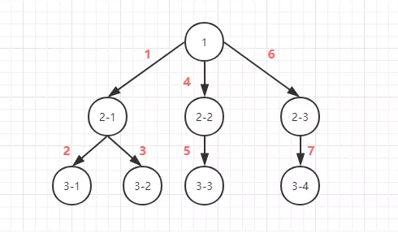

## 算法题

> - 栈方法：
>
> 　　　　　　push() 给数组最后添加元素，参数可以是多个，也就添加多个,返回添加后的数组的长度
>
> 　　　　　　pop(),把数组最后一元素删除，返回删掉的元素，该方法没有参数
>
> - 队列方法：
>
> 　　　　　　shift() 删除数组的第一个元素，返回被删除的元素，该方法没有参数
>
> 　　　　　　unshift() 向数组开头添加元素，参数可以是多个，也就添加多个,返回添加后的数组的长度

### 1.算法手写题（数组扁平）

> 已知如下数组：
>
> var arr = [ [1, 2, 2], [3, 4, 5, 5], [6, 7, 8, 9, [11, 12, [12, 13, [14] ] ] ], 10];
>
> 编写一个程序将数组扁平化去并除其中重复部分数据，最终得到一个升序且不重复的数组

1. 递归

   ```js
   function spreadArr(arr=[]){
   	if(arr.some(ele=>Array.isArray(ele))){
   		let newArr = [];
   		arr.forEach((ele) => {
   			if(Array.isArray(ele)){
   				newArr = newArr.concat(...ele)
   			}else{
   				if(!newArr.includes(ele)) newArr.push(ele)
   			}
   		})
   		return spreadArr(newArr);
   	}
   	return arr.sort((a,b)=> a-b);
   }
   spreadArr([ [1, 2, 2], [3, 4, 5, 5], [6, 7, 8, 9, [11, 12, [12, 13, [14] ] ] ], 10]);
   ```

2. Es6的新语法

   ```js
   var arr = [ [1, 2, 2], [3, 4, 5, 5], [6, 7, 8, 9, [11, 12, [12, 13, [14] ] ] ], 10]
   // 扁平化方法flat
   // let flatArr = arr.flat(4)      
   //  flat方法参数可以固定填固定值 
   //  不固定参数是Infinity关键字
   //  flat()方法会跳过空位
   let flatArr = arr.flat(Infinity) 
   // 去重
   let disArr = Array.from(new Set(flatArr))
   // 排序
   let result = disArr.sort(function(a, b) {
       return a-b
   })
   console.log(result)// [1, 2, 3, 4, 5, 6, 7, 8, 9, 10, 11, 12, 13, 14]
   ```

### 2. 介绍下深度优先遍历和广度优先遍历，如何实现？

#### 深度优先遍历（DFS）

如图:

​	

- 深度优先不需要记住所有的节点, 所以占用空间小, 而广度优先需要先记录所有的节点占用空间大
- 深度优先采用的是堆栈的形式, 即先进后出

#### 广度优先遍历（BFS）

如图:

​	

- 深度优先有回溯的操作(没有路走了需要回头)所以相对而言时间会长一点

- 广度优先则采用的是队列的形式, 即先进先出

  参详code实现

### 3.介绍下观察者模式和订阅-发布模式的区别，各自适用于什么场景

> 观察者模式中主体和观察者是互相感知的，发布-订阅模式是借助第三方来实现调度的，发布者和订阅者之间互不感知

###### 观察者模式（Observer）

观察者模式指的是一个对象（Subject）维持一系列依赖于它的对象（Observer），当有关状态发生变更时 Subject 对象则通知一系列 Observer 对象进行更新。

在观察者模式中，Subject 对象拥有添加、删除和通知一系列 Observer 的方法等等，而 Observer 对象拥有更新方法等等。

在 Subject 对象添加了一系列 Observer 对象之后，Subject 对象则维持着这一系列 Observer 对象，当有关状态发生变更时 Subject 对象则会通知这一系列 Observer 对象进行更新

```js
// Subject
function Subject(){
  this.observers = [];
}
// Subject的方法
Subject.prototype = {
  add:function(observer){  // 添加
    this.observers.push(observer);
  },
  remove:function(observer){  // 删除
    var observers = this.observers;
    for(var i = 0;i < observers.length;i++){
      if(observers[i] === observer){
        observers.splice(i,1);
      }
    }
  },
  notify:function(){  // 通知
    var observers = this.observers;
    for(var i = 0;i < observers.length;i++){
      observers[i].update();
    }
  }
}
// Observer
function Observer(name){
  this.name = name;
}
// Observer方法
Observer.prototype = {
  update:function(){  // 更新
    console.log('my name is '+this.name);
  }
}

// 实例Subject、Observer
var sub = new Subject();
var obs1 = new Observer('ttsy1');
var obs2 = new Observer('ttsy2');
// 添加Observer
sub.add(obs1);
sub.add(obs2);
// 更新Observer
sub.notify();  //my name is ttsy1、my name is ttsy2
// 删除Observer
sub.remove(obs2);
```

###### 发布订阅模式（Publisher && Subscriber）

发布订阅模式指的是希望接收通知的对象（Subscriber）基于一个主题通过自定义事件订阅主题，被激活事件的对象（Publisher）通过发布主题事件的方式通知各个订阅该主题的 Subscriber 对象。

```js
let pubSub = {
  list:{},
  subscribe:function(key,fn){  // 订阅
    if (!this.list[key]) {
      this.list[key] = [];
    }
    this.list[key].push(fn);
  },
  publish:function(){  // 发布
    let arg = arguments;
    let key = [].shift.call(arg);
    let fns = this.list[key];

    if(!fns || fns.length<=0) return false;

    for(var i=0,len=fns.length;i<len;i++){
      fns[i].apply(this, arg);
    }

  },
  unSubscribe(key) {  // 取消订阅
    delete this.list[key];
  }
};

pubSub.subscribe('name', (name) => {
  console.log('your name is ' + name);
});
pubSub.subscribe('sex', (sex) => {
  console.log('your sex is ' + sex);
});
pubSub.publish('name', 'ttsy1');  // your name is ttsy1
pubSub.publish('sex', 'male');  // your sex is male
```

上述代码的订阅是基于 name 和 sex 主题来自定义事件，发布是通过 name 和 sex 主题并传入自定义事件的参数，最终触发了特定主题的自定义事件。

可以通过 unSubscribe 方法取消特定主题的订阅。

```js
pubSub.subscribe('name', (name) => {
  console.log('your name is ' + name);
});
pubSub.subscribe('sex', (sex) => {
  console.log('your sex is ' + sex);
});
pubSub.unSubscribe('name');
pubSub.publish('name', 'ttsy1');  // 这个主题被取消订阅了
pubSub.publish('sex', 'male');  // your sex is male
```

### 4. 实现双向绑定Proxy比defineproperty优劣如何?

1. 基于数据劫持实现的双向绑定的特点

   > 数据劫持比较好理解,通常我们利用`Object.defineProperty`劫持对象的访问器,在属性值发生变化时我们可以获取变化,从而进行进一步操作。

   ```JS
   // 这是将要被劫持的对象
   const data = {
     name: '',
   };
   
   function say(name) {
     if (name === '古天乐') {
       console.log('给大家推荐一款超好玩的游戏');
     } else if (name === '渣渣辉') {
       console.log('戏我演过很多,可游戏我只玩贪玩懒月');
     } else {
       console.log('来做我的兄弟');
     }
   }
   
   // 遍历对象,对其属性值进行劫持
   Object.keys(data).forEach(function(key) {
     Object.defineProperty(data, key, {
       enumerable: true,
       configurable: true,
       get: function() {
         console.log('get');
       },
       set: function(newVal) {
         // 当属性值发生变化时我们可以进行额外操作
         console.log(`大家好,我系${newVal}`);
         say(newVal);
       },
     });
   });
   
   data.name = '渣渣辉';
   //大家好,我系渣渣辉
   //戏我演过很多,可游戏我只玩贪玩懒月
   ```

   基于数据劫持的双向绑定离不开`Proxy`与`Object.defineProperty`等方法对对象/对象属性的"劫持",我们要实现一个完整的双向绑定需要以下几个要点。

   - 利用`Proxy`或`Object.defineProperty`生成的Observer针对对象/对象的属性进行"劫持",在属性发生变化后通知订阅者

   - 解析器Compile解析模板中的`Directive`(指令)，收集指令所依赖的方法和数据,等待数据变化然后进行渲染

   - Watcher属于Observer和Compile桥梁,它将接收到的Observer产生的数据变化,并根据Compile提供的指令进行视图渲染,使得数据变化促使视图变化

2. 基于Object.defineProperty双向绑定的特点

   

3. 基于Proxy双向绑定的特点

### 5. 实现深拷贝浅拷贝

### 6. 手写实现promise(超级简易版)

```js
/* 
Promise类系统自带,类中需要传入一个executor执行器，默认立即执行
Promise类内部会提供两个方法 resolve（成功）、reject（失败） ,可以更改promise的3个状态: （等待、成功、失败）
 */
// 宏变量 
const PENDING = 'PENDING' // 等待
const RESOLVE = 'RESOLVE' // 成功
const REJECT = 'REJECT' // 失败
class Promise {
    constructor(executor) {
        this.status = PENDING // 默认是等待状态
        this.value = undefined // 成功的原因
        this.reason = undefined // 失败的原因
        /* 
        只有在pending状态下 才会转向成功或者失败
        保证状态只有pending下 才能改变
        */
        let resolve = (value) => {
            if (this.status === PENDING) {
                this.value = value
                this.status = RESOLVE
            }

        }
        let reject = (reason) => {
            if (this.status === PENDING) {
                this.reason = reason
                this.status = REJECT
            }

        }
        // 执行executor 传入成功和失败
        try {
            executor(resolve, reject) // 立即执行
        } catch (e) {
            console.log('catch' + e)
            reject(e); // 如果出现错误手动调用reject向下传递
        }
    }
    then(onfulfilled, onrejected) {
        if (this.status === RESOLVE) {
            onfulfilled(this.value)
        }
        if (this.status === REJECT) {
            onrejected(this.reason)
        }
    }
}
module.exports = Promise
```

### 7. 手写实现diff算法

### 8. 