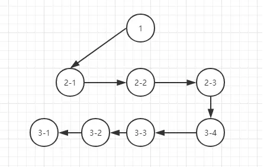
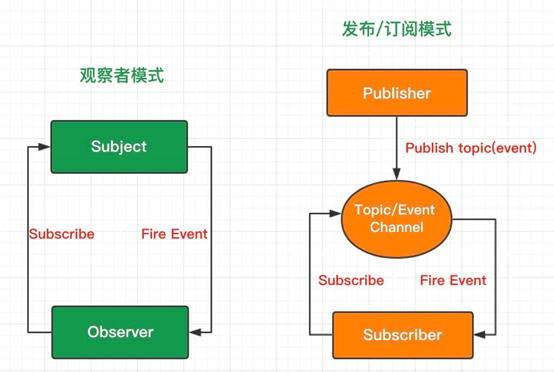

### 01. 深度优先遍历(DFS) 和 广度优先遍历(BFS)

> 面试题:
>
> ​	给定一个二叉树，使用 DFS 和 BFS 遍历返回所有节点。 

#### 深度优先遍历（DFS）

- DFS 的思想是从上至下，对每一个分支一直往下一层遍历直到这个分支结束，然后返回上一层，对上一层的右子树这个分支继续深搜，直到一整棵树完全遍历，因此符合栈**后进先出**的特点
- 深度优先遍历常用的数据结构是**栈**
- DFS 特性 : 不全部保留结点，占用空间少;有回溯操作(即有入栈、出栈操作)，运行速度慢。

#### 广度优先遍历（BFS）

- BFS 的思想是从左至右，对树的每一层所有结点依次遍历，当一层的结点遍历完全后，对下一层开始遍历，而下一层结点又恰好是上一层的子结点。因此符合队**列先进先出**的特点
- 深度优先遍历常用的数据结构为队列
- BFS 的特性 : 保留全部结点，占用空间大;无回溯操作(即无入栈、出栈操作)，运行速度快。 

## 02. 发布订阅者和观察者

 	

**观察者模式：**观察者（Observer）直接订阅（Subscribe）主题（Subject），而当主题被激活的时候，会触发（Fire Event）观察者里的事件。

**发布订阅模式：**订阅者（Subscriber）把自己想订阅的事件注册（Subscribe）到调度中心（Topic），当发布者（Publisher）发布该事件（Publish topic）到调度中心，也就是该事件触发时，由调度中心统一调度（Fire Event）订阅者注册到调度中心的处理代码。

## 03. 防抖和截流 

在开发的过程中，我们经常会需要绑定一些持续触发的事件，如 resize、scroll、mousemove 等等，但有些时候我们并不希望在事件持续触发的过程中那么频繁地去执行函数浪费性能。

#### 防抖（debounce）

> 指触发事件后在 n 秒内函数只能执行一次，如果在 n 秒内又触发了事件，则会重新计算函数执行时间

一个频繁触发的函数，在规定时间内，只让最后一次生效，前面的不生效。

原理：在第一次调用函数的时候，创建一个定时器，在指定的时间间隔之后运行代码；如果代码还没运行时，又触发了该函数，则清除旧的定时器，重新创建新的定时器；如果超过延时执行的时间，代码执行了，则此时已经是第二次触发；

- earch搜索联想，用户在不断输入值时，用防抖来节约请求资源。
- window触发resize的时候，不断的调整浏览器窗口大小会不断的触发这个事件，用防抖来让其只触发一次

#### 节流（throttle）

> 指连续触发事件但是在 n 秒中只执行一次函数

一个频繁触发的函数，在规定时间内，函数执行一次后，只有大于设定的执行周期后才会执行第二次。

原理：第一次执行函数的时候，记录函数执行的时间，当下一次执行的时候，比较时间是否还在间隔时间内，如果是则不执行，否则继续执行；

- 鼠标不断点击触发，mousedown(单位时间内只触发一次)
- 监听滚动事件，比如是否滑到底部自动加载更多，用throttle来判断

**函数防抖和节流，都是控制事件触发频率的方法。应用场景有很多，输入框持续输入，将输入内容远程校验、多次触发点击事件、onScroll等等。**

## 04. 深拷贝和浅拷贝

> 深拷贝和浅拷贝最根本的区别在于是否是真正获取了一个对象的复制实体，而不是引用，
> **深拷贝在计算机中开辟了一块内存地址用于存放复制的对象，而浅拷贝仅仅是指向被拷贝的内存地址，如果原地址中对象被改变了，那么浅拷贝出来的对象也会相应改变。**

## 04. 浅拷贝和深拷贝

**浅拷贝：**仅仅是指向被复制的内存地址，如果原地址发生改变，那么浅复制出来的对象也会相应的改变。

> 创建一个新对象，这个对象有着原始对象属性值的一份精确拷贝。如果属性是基本类型，拷贝的就是基本类型的值，如果属性是引用类型，拷贝的就是内存地址 ，所以如果其中一个对象改变了这个地址，就会影响到另一个对象。

**深拷贝：**在计算机中开辟一块**新的内存地址**用于存放复制的对象。

> 将一个对象从内存中完整的拷贝一份出来,从堆内存中开辟一个新的区域存放新对象,且修改新对象不会影响原对象

**深拷贝和浅拷贝最根本的区别在于是否是真正获取了一个对象的复制实体，而不是引用。**

**浅拷贝实现方法:**

1. Object.assign

   - Object.assign是一个浅拷贝,它只是在**根属性**(对象的第一层级)创建了一个新的对象，但是对于属性的值是仍是对象的话依然是浅拷贝

   - 不会拷贝对象继承的属性

   - 不可枚举的属性

   - 可以拷贝Symbol类型

2. 扩展运算符、slice、concat

   - 和assgin一样只拷贝一层

**深拷贝实现方法:**

1. 循环+递归
   - 只能实现object、array的深拷贝
   - for...in 无法获得 Symbol 类型的键，而 Reflect 可以获取

2. JSON.stringify

   - 拷贝的对象的值中如果有函数,undefined,symbol则经过JSON.stringify()序列化后的JSON字符串中这个键值对会消失

   - 无法拷贝不可枚举的属性， 无法拷贝对象的原型链

   - 拷贝Date引用类型会变成字符串

   - 拷贝RegExp引用类型会变成空对象

   - 对象中含有NaN、 Infinity和 - Infinity， 则序列化的结果会变成null

   - 无法拷贝对象的循环应用(即obj[key] = obj)

3. lodash([第三方库](https://github.com/lodash/lodash/blob/master/.internal/baseClone.js)）

## 05. Diff算法

## 06. 实现PromiseA+

## 07. 从0到1实现redux

