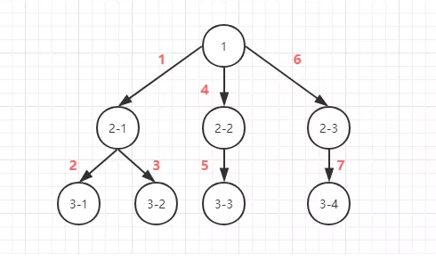
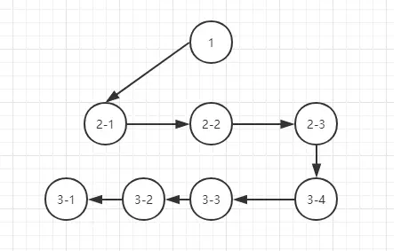
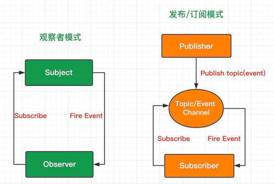

## 01. 深度优先遍历(DFS) 和 广度优先遍历(BFS)

> 面试题:
>
> ​	给定一个二叉树，使用 DFS 和 BFS 遍历返回所有节点。 

#### 深度优先遍历（DFS）



- DFS 的思想是从上至下，对每一个分支一直往下一层遍历直到这个分支结束，然后返回上一层，对上一层的右子树这个分支继续深搜，直到一整棵树完全遍历，因此符合栈**后进先出**的特点
- 深度优先遍历常用的数据结构是**栈**
- DFS 特性 : 不全部保留结点，占用空间少;有回溯操作(即有入栈、出栈操作)，运行速度慢。

#### 广度优先遍历（BFS）



- BFS 的思想是从左至右，对树的每一层所有结点依次遍历，当一层的结点遍历完全后，对下一层开始遍历，而下一层结点又恰好是上一层的子结点。因此符合队**列先进先出**的特点
- 深度优先遍历常用的数据结构为队列
- BFS 的特性 : 保留全部结点，占用空间大;无回溯操作(即无入栈、出栈操作)，运行速度快。 

## 02. 发布订阅者和观察者

 	

**观察者模式：**观察者（Observer）直接订阅（Subscribe）主题（Subject），而当主题被激活的时候，会触发（Fire Event）观察者里的事件。

**发布订阅模式：**订阅者（Subscriber）把自己想订阅的事件注册（Subscribe）到调度中心（Topic），当发布者（Publisher）发布该事件（Publish topic）到调度中心，也就是该事件触发时，由调度中心统一调度（Fire Event）订阅者注册到调度中心的处理代码。

## 03. 防抖和截流 

在开发的过程中，我们经常会需要绑定一些持续触发的事件，如 resize、scroll、mousemove 等等，但有些时候我们并不希望在事件持续触发的过程中那么频繁地去执行函数浪费性能。

#### 防抖（debounce）

> 指触发事件后在 n 秒内函数只能执行一次，如果在 n 秒内又触发了事件，则会重新计算函数执行时间

一个频繁触发的函数，在规定时间内，只让最后一次生效，前面的不生效。

原理：在第一次调用函数的时候，创建一个定时器，在指定的时间间隔之后运行代码；如果代码还没运行时，又触发了该函数，则清除旧的定时器，重新创建新的定时器；如果超过延时执行的时间，代码执行了，则此时已经是第二次触发；

- earch搜索联想，用户在不断输入值时，用防抖来节约请求资源。
- window触发resize的时候，不断的调整浏览器窗口大小会不断的触发这个事件，用防抖来让其只触发一次

#### 节流（throttle）

> 指连续触发事件但是在 n 秒中只执行一次函数

一个频繁触发的函数，在规定时间内，函数执行一次后，只有大于设定的执行周期后才会执行第二次。

原理：第一次执行函数的时候，记录函数执行的时间，当下一次执行的时候，比较时间是否还在间隔时间内，如果是则不执行，否则继续执行；

- 鼠标不断点击触发，mousedown(单位时间内只触发一次)
- 监听滚动事件，比如是否滑到底部自动加载更多，用throttle来判断

**函数防抖和节流，都是控制事件触发频率的方法。应用场景有很多，输入框持续输入，将输入内容远程校验、多次触发点击事件、onScroll等等。**

## 04. 浅拷贝和深拷贝

**浅拷贝：**仅仅是指向被复制的内存地址，如果原地址发生改变，那么浅复制出来的对象也会相应的改变。

> 创建一个新对象，这个对象有着原始对象属性值的一份精确拷贝。如果属性是基本类型，拷贝的就是基本类型的值，如果属性是引用类型，拷贝的就是内存地址 ，所以如果其中一个对象改变了这个地址，就会影响到另一个对象。

**深拷贝：**在计算机中开辟一块**新的内存地址**用于存放复制的对象。

> 将一个对象从内存中完整的拷贝一份出来,从堆内存中开辟一个新的区域存放新对象,且修改新对象不会影响原对象

**深拷贝和浅拷贝最根本的区别在于是否是真正获取了一个对象的复制实体，而不是引用。**

**浅拷贝实现方法:**

1. Object.assign

   - Object.assign是一个浅拷贝,它只是在**根属性**(对象的第一层级)创建了一个新的对象，但是对于属性的值是仍是对象的话依然是浅拷贝

   - 不会拷贝对象继承的属性

   - 不可枚举的属性

   - 可以拷贝Symbol类型

2. 扩展运算符、slice、concat

   - 和assgin一样只拷贝一层

**深拷贝实现方法:**

1. 循环+递归
   - 只能实现object、array的深拷贝
   - for...in 无法获得 Symbol 类型的键，而 Reflect 可以获取

2. JSON.stringify

   - 拷贝的对象的值中如果有函数,undefined,symbol则经过JSON.stringify()序列化后的JSON字符串中这个键值对会消失

   - 无法拷贝不可枚举的属性， 无法拷贝对象的原型链

   - 拷贝Date引用类型会变成字符串

   - 拷贝RegExp引用类型会变成空对象

   - 对象中含有NaN、 Infinity和 - Infinity， 则序列化的结果会变成null

   - 无法拷贝对象的循环应用(即obj[key] = obj)

3. lodash([第三方库](https://github.com/lodash/lodash/blob/master/.internal/baseClone.js)）

## 05. 介绍下重绘和回流（Repaint & Reflow）,以及如何优化?

#### 1. 浏览器渲染机制

- 浏览器采用流式布局模型（`Flow Based Layout`）
- 浏览器会把`HTML`解析成`DOM Tree`，解析`css`构建`render`树（将css代码解析成树形的数据结构，然后结合DOM合并成render树）
- 有了`RenderTree`，我们就知道了所有节点的样式，然后计算他们在页面上的大小和位置，最后把节点绘制到页面上。
- 由于浏览器使用流式布局，对`Render Tree`的计算通常只需要遍历一次就可以完成，**但`table`及其内部元素除外，他们可能需要多次计算，通常要花3倍于同等元素的时间，这也是为什么要避免使用`table`布局的原因之一**。

#### 2. 重绘

​	由于节点的几何属性发生改变或者由于样式发生改变而不会影响布局的，称为重绘，例如`outline`, `visibility`, `color`、`background-color`等，重绘的代价是高昂的，因为浏览器必须验证DOM树上其他节点元素的可见性。

#### 3. 回流

回流是布局或者几何属性需要改变就称为回流。回流是影响浏览器性能的关键因素，因为其变化涉及到部分页面（或是整个页面）的布局更新。一个元素的回流可能会导致了其所有子元素以及DOM中紧随其后的节点、祖先节点元素的随后的回流。因为其在DOM中在回流元素之后，**大部分的回流将导致页面的重新渲染，回流必定会发生重绘，重绘不一定会引发回流。**

#### 4. 浏览器优化

现代浏览器大多都是通过队列机制来批量更新布局，浏览器会把修改操作放在队列中，至少一个浏览器刷新（即16.6ms）才会清空队列，但是当你**获取布局信息的时候 比如`改变元素的宽高`，`元素的位置`，导致浏览器不得不重新计算元素的几何属性，队列中可能有会影响这些属性或方法返回值的操作，即使没有，浏览器也会强制清空队列，触发回流与重绘来确保返回正确的值并重新构建渲染树**

主要包括以下属性或方法：

- `offsetTop`、`offsetLeft`、`offsetWidth`、`offsetHeight`
- `scrollTop`、`scrollLeft`、`scrollWidth`、`scrollHeight`
- `clientTop`、`clientLeft`、`clientWidth`、`clientHeight`
- `width`、`height`
- `getComputedStyle()`
- `getBoundingClientRect()`

所以，我们应该避免频繁的使用上述的属性，它们都会强制渲染刷新队列。

#### 5. 减少重绘与回流

1. CSS

   - **使用 `transform` 替代 `top`**

   - **使用 `visibility` 替换 `display: none`** ，因为前者只会引起重绘，后者会引发回流（改变了布局)

   - **避免使用`table`布局**，可能很小的一个小改动会造成整个 `table` 的重新布局。

   - **尽可能在`DOM`树的最末端改变`class`**，回流是不可避免的，但可以减少其影响。尽可能在DOM树的最末端改变class，可以限制了回流的范围，使其影响尽可能少的节点。

   - **避免设置多层内联样式**，css 选择符**从右往左**匹配查找，避免节点层级过多,保证**层级扁平**。

   - **将动画效果应用到`position`属性为`absolute`或`fixed`的元素上**，避免影响其他元素的布局，这样只是一个重绘，而不是回流，同时，控制动画速度可以选择 `requestAnimationFrame`。
   
   - **避免使用`CSS`表达式**，可能会引发回流。
   
   - **CSS3 硬件加速**可以让`transform`、`opacity`、`filters`这些动画不会引起回流重绘 。但是对于动画的其它属性，比如`background-color`这些，还是会引起回流重绘的，不过它还是可以提升这些动画的性能。
   
2. JS

   - **避免频繁操作样式**，最好一次性重写`style`属性，或者将样式列表定义为`class`并一次性更改`class`属性。
   - **避免频繁操作`DOM`**，创建一个`documentFragment`，在它上面应用所有`DOM操作`，最后再把它添加到文档中。
   - **避免频繁读取会引发回流/重绘的属性**，如果确实需要多次使用，就用一个变量缓存起来。
   
   - **对具有复杂动画的元素使用绝对定位**，使它脱离文档流，否则会引起父元素及后续元素频繁回流。

## 06. Promise 和 Async

1. Promise和Callback有什么区别

   - 深度和宽度的区别都能解决异步
   - Promise是ES6标准提出异步编程解决方案

2. Promise有几个状态

   - pending 等待、fulfilled 成功、rejected 失败

3. Promise构造函数是同步还是异步执行，then那

   - Promise构造函数是同步,then是异步

4. Promise如何实现

5. Promise的优缺点

   **优点**
    promise对象，可以将 **异步操作** 以 **同步操作的流程** 表达出来，避免层层嵌套

   **缺点**

   1. 无法取消 Promise，一旦新建它就会立即执行，无法中途取消。
   2. 如果不设置回调函数，Promise 内部抛出的错误，不会反映到外部。
   3. 处于pending状态时，是不能知道目前进展到哪个阶段的 ( 刚开始？，即将结束？)

6. 如何设计Promise.all()

7. Promise怎么异常捕获

   1. reject

   2. catch（推荐）

      > 因为catch可以捕获执行中的错误，也更接近同步的写法(try/catch)

   3. 捕获不了异步错误  因为 try catch只能捕获同步错误

9. Async/Await和Promise的区别
   1. 简洁不用写匿名参数调用
   2. Async/Await让try/catch可以同时处理同步和异步错误
   3. Async/Await可以让程序中断
   4. 条件语句
   5. 错误栈

10. Async/Await内部实现原理

    ​	Generator+CO模块

    1. 内置执行器，不需要使用next()手动执行。
    2. await命令后面可以是Promise对象或原始类型的值，yield命令后面只能是Thunk函数或Promise对象。
    3. 返回值是Promise。返回非Promise时，async函数会把它包装成Promise返回。(Promise.resolve(value))

## 07. Vue自定事件的原理

1. 基本用法

   ```js
   vm.$emit('自定义事件的名称',this.data) // 触发事件
   vm.$on('自定义事件的名称',function(data){}) // 监听事件
   ```

   **注意**:

   ​	 如果是子到父通信 不能用 $on 侦听子组件抛出的事件，而**必须**在模板里直接用 v-on 绑定。
   ​	 就是父组件可以在使用子组件的地方直接用 v-on 来监听子组件触发的事件。

2. 实现原理

   - 子父通信原理 (观察者模式)

   - 事件总线原理 (发布订阅者模式)

   > on只能监听同一个Vue实例上emit出来的事件，事件总线就是靠这个机制实现数据传递的。
   >
   > 但是父子组件是独立的Vue实例, 所以emit的事件,如果不在使用它的时候监听这个自定义事件，
   >
   > 在父组件里面如果用on是监听不到的, 但是可以在一个组件里面通信(至今没发现有什么用)

## 08. Vue如何优化首页加载

1. 首页白屏原因

   > 主要原因是单页应用,加载资源过慢， 需要将所有需要的资源都下载到浏览器端并解析。单页面应用的html 是靠 js 生成，因为首屏需要加载很大的js文件(`app.js` `vendor.js`)，所以当网速差的时候会产生一定程度的白屏。

2. 首屏优化方法

   1. 在路由返回内容前添加loading(骨架屏)
      - [vue-server-renderer](https://links.jianshu.com/go?to=https%3A%2F%2Fgithub.com%2Fvuejs%2Fvue%2Ftree%2Fdev%2Fpackages%2Fvue-server-renderer%23readme)
      - [vue-skeleton-webpack-plugin](https://links.jianshu.com/go?to=https%3A%2F%2Fgithub.com%2Flavas-project%2Fvue-skeleton-webpack-plugin)
      - [page-skeleton-webpack-plugin](https://links.jianshu.com/go?to=https%3A%2F%2Fgithub.com%2FElemeFE%2Fpage-skeleton-webpack-plugin)
   2. 使用首屏SSR + 跳转SPA方式来优化
   3. 改单页应用为多页应用,使用quicklink(单页面配合路由)技术
   4. 协议优化(**B站前端铁蛋**儿)
   5. 使用web worker
   6. 第三方资源使用cdn
   7. 优化webpackp配置
      - webpack的code-split结合vue-router做懒加载
      - wepack的contenthash模式,针对文件级别更改做缓存

   8. 图片使用webp、小图采用base64编码、雪碧图等

## 09. React 和 Vue 循环为什么加key？

> 基于没有key的情况diff速度会更快, 没有绑定key的情况下遍历节点的时候,虚拟DOM的新旧节点会复用。

```html
<div id="app">
    <div v-for="i in dataList">{{ i }}</div>
</div>
```

```js
let vm = new Vue({
  el: '#app',
  data: {
    dataList: [1, 2, 3, 4, 5]
  }
})
```

以上的例子，v-for的内容会生成以下的dom节点数组，我们给每一个节点标记一个身份id：

```js
[
  '<div>1</div>', // id： A
  '<div>2</div>', // id:  B
  '<div>3</div>', // id:  C
  '<div>4</div>', // id:  D
  '<div>5</div>'  // id:  E
]
```

**1. 改变dataList数据**

```js
vm.dataList = [5, 4, 3, 1, 2]
// 没有key的情况， 节点位置不变，但是节点innerText内容更新了
  [
    '<div>5</div>', // id： A
    '<div>4</div>', // id:  B
    '<div>3</div>', // id:  C
    '<div>1</div>', // id:  D
    '<div>2</div>'  // id:  E
  ]

// 有key的情况，dom节点位置进行了交换，但是内容没有更新
// <div v-for="i in dataList" :key='i'>{{ i }}</div>
  [
    '<div>5</div>', // id： D
    '<div>4</div>', // id:  A
    '<div>3</div>', // id:  C
    '<div>1</div>', // id:  E
    '<div>2</div>'  // id:  B
  ]
```

**2. 增删dataList数据**

```js
vm.dataList = [3, 4, 5, 6, 7] // 数据进行增删
// 没有key的情况， 节点位置不变，内容也更新了
[
  '<div>3</div>', // id： A
  '<div>4</div>', // id:  B
  '<div>5</div>', // id:  C
  '<div>6</div>', // id:  D
  '<div>7</div>'  // id:  E
]

// 有key的情况， 节点删除了 A, B 节点，新增了 F, G 节点
// <div v-for="i in dataList" :key='i'>{{ i }}</div>
[
  '<div>3</div>', // id： C
  '<div>4</div>', // id:  D
  '<div>5</div>', // id:  E
  '<div>6</div>', // id:  F
  '<div>7</div>'  // id:  G
]
```

​	从以上来看，不带有key，**并且使用简单的模板，**基于这个前提下，可以更有效的复用节点，diff对比也是不带key的快，因为带key在增删节点上有耗时。这就是Vue文档所说的**默认模式**。但是这个并不是key作用，而是没有key的情况下可以对节点就地复用，提高性能。

​	这种模式会带来一些隐藏的副作用，比如可能不会产生过渡效果，或者在某些节点有绑定数据（表单）状态，会出现状态错位。Vue文档也说明了这个默认的模式是高效的，但是只适用于不依赖子组件状态或临时 DOM 状态  的列表渲染输出(例如：表单输入值)。

​	为什么还要建议带key呢？因为这种不带key只适用于渲染简单的无状态组件。对于大多数场景来说，列表组件都有自己的状态。

## 10.Vue和React路由实现的原理

> vue-router和react-router实现原理大同小异，更新视图但不重新请求页面是前端路由原理的核心之一，目前在浏览器环境中的实现有2种方式

1. hash模式（老版浏览器支持）

   原理是 onhashchage 事件可以在window对象上监听这个事件

2. History模式(高版本浏览器支持)

   原理是利用History 在 HTML5中新增的方法

**两种方式对比:**

- hash模式
  - 通过路径中的hash值来控制路由跳转，不存在兼容问题

- history
  - 利用了HTML5 History 中新增的 pushState() 方法。
  - 需要后台配置支持。如果刷新时，服务器没有响应响应的资源，会刷出404，

**路由面试题:**

1. Vue路由的实现原理 
2. SPA路由history模式上线后刷新404
   - 在服务端增加一个覆盖所有情况的候选资源：如果 URL 匹配不到任何静态资源，则应该返回同一个 index.html 页面。
3. $(route/router)的区别
   - $route是路由信息对象
   - $router是路由实例对象

4. 路由里的 <Link> 标签和 <a> 标签有什么区别

```js
Link 的本质也是a 标签。只不过在Link 中禁用了 a 标签的默认事件，改用了history对象提供的方法进行跳转。
```

**原生实现hash和history两种路由模式:**

​	参照code

## 11. webpack的打包原理

1. 简单需求

   - 浏览器不支持ES6的模块

2. 核心打包功能

   ```js
   // 打包工作的基本流程如下：
   1. 需要读到入口文件里的内容
   2. 分析入口文件，递归的去读取模块所依赖的文件内容，生成AST语法树
   3. 根据AST语法树，生成浏览器能够运行的最终代码
   ```

   1. 获取模块内容
   2. 分析模块内容
      - 安装@babel/parser包（转AST）
   3. 对模块内容处理
      - 安装@babel/traverse包（遍历AST）
      - 安装@babel/core和@babel/preset-env包（Es6转Es5）
   4. 递归所有模块
   5. 生成最终代码

3. 手动loader、plugin
   1. 实现一个同步的loader
   2. 实现一个异步的loader
   3. 实现一个plugin

## 12.Vue 2.0和Vue3.0 响应式原理的区别？ 

#### Object.defineProperty和Proxy区别

1. Object.defineProperty无法监控到数组方法，导致通过数组添加元素，不能实时响应；

2. Object.defineProperty只能劫持对象的属性，从而需要对每个对象，每个属性进行遍历，

   如果，属性值是对象，还需要深度遍历。Proxy可以劫持整个对象，**并返回一个新的对象**。

3. Proxy不仅可以代理对象，还可以代理数组。还可以代理动态增加的属性。 

## 13. 写 React / Vue 项目时为什么要在列表组件中写 key，其作用是什么？

> ​	没有绑定key的情况下，并且在遍历模板`简单`的情况下，会导致虚拟新旧节点对比更快，节点也会复用。而这种复用是`就地复用`，一种`鸭子辩型`的复用。以下为简单的例子:

```html
<div id="app">
    <div v-for="i in dataList">{{ i }}</div> 
</div>
var vm = new Vue({
  el: '#app',
  data: {
    dataList: [1, 2, 3, 4, 5]
  }
})
```

以上的例子，v-for的内容会生成以下的dom节点数组，我们给每一个节点标记一个身份id：

```html
  [
    '<div>1</div>', // id： A
    '<div>2</div>', // id:  B
    '<div>3</div>', // id:  C
    '<div>4</div>', // id:  D
    '<div>5</div>'  // id:  E
  ]
```

> 1. 改变dataList数据，进行数据位置替换，对比改变后的数据

```html
 vm.dataList = [4, 1, 3, 5, 2] // 数据位置替换

 // 没有key的情况， 节点位置不变，但是节点innerText内容更新了
  [
    '<div>4</div>', // id： A
    '<div>1</div>', // id:  B
    '<div>3</div>', // id:  C
    '<div>5</div>', // id:  D
    '<div>2</div>'  // id:  E
  ]

  // 有key的情况，dom节点位置进行了交换，但是内容没有更新
  // <div v-for="i in dataList" :key='i'>{{ i }}</div>
  [
    '<div>4</div>', // id： D
    '<div>1</div>', // id:  A
    '<div>3</div>', // id:  C
    '<div>5</div>', // id:  E
    '<div>2</div>'  // id:  B
  ]
```

> 增删dataList列表项

```html
  vm.dataList = [3, 4, 5, 6, 7] // 数据进行增删

  // 1. 没有key的情况， 节点位置不变，内容也更新了
  [
    '<div>3</div>', // id： A
    '<div>4</div>', // id:  B
    '<div>5</div>', // id:  C
    '<div>6</div>', // id:  D
    '<div>7</div>'  // id:  E
  ]

  // 2. 有key的情况， 节点删除了 A, B 节点，新增了 F, G 节点
  // <div v-for="i in dataList" :key='i'>{{ i }}</div>
  [
    '<div>3</div>', // id： C
    '<div>4</div>', // id:  D
    '<div>5</div>', // id:  E
    '<div>6</div>', // id:  F
    '<div>7</div>'  // id:  G
  ]
```

从以上来看，不带有key，并且使用简单的模板，基于这个前提下，可以更有效的复用节点，diff速度来看也是不带key更加快速的，因为带key在增删节点上有耗时。这就是vue文档所说的`默认模式`。但是这个并不是key作用，而是没有key的情况下可以对节点`就地复用`，提高性能。

这种模式会带来一些隐藏的副作用，比如可能不会产生过渡效果，或者在某些节点有绑定数据（表单）状态，会出现状态错位。VUE文档也说明了 [`这个默认的模式是高效的，但是只适用于不依赖子组件状态或临时 DOM 状态 (例如：表单输入值) 的列表渲染输出`](https://cn.vuejs.org/v2/guide/list.html#key)

在不带key的情况下，对于`简单列表页渲染`来说diff节点更快是没有错误的。但是这并不是key的作用。

### 但是key的作用是什么？

> key是给每一个vnode的唯一id,可以`依靠key`,更`准确`, 更`快`的拿到oldVnode中对应的vnode节点。

##### 1. 更准确

因为带key就不是`就地复用`了，在sameNode函数 `a.key === b.key`对比中可以避免就地复用的情况。所以会更加准确。

##### 2. 更快

利用key的唯一性生成map对象来获取对应节点，比遍历方式更快。(map会比遍历更快。)

> ​	vue和react都是采用diff算法来对比新旧虚拟节点，从而更新节点。在vue的diff函数中（建议先了解一下diff算法过程）。
> 在交叉对比中，当新节点跟旧节点`头尾交叉对比`没有结果时，会根据新节点的key去对比旧节点数组中的key，从而找到相应旧节点（这里对应的是一个key => index 的map映射）。如果没找到就认为是一个新增节点。而如果没有key，那么就会采用遍历查找的方式去找到对应的旧节点。一种一个map映射，另一种是遍历查找。相比而言。map映射的速度更快。
> vue部分源码如下：

```js
// vue项目  src/core/vdom/patch.js  -488行
// 以下是为了阅读性进行格式化后的代码

// oldCh 是一个旧虚拟节点数组
if (isUndef(oldKeyToIdx)) {
  oldKeyToIdx = createKeyToOldIdx(oldCh, oldStartIdx, oldEndIdx)
}
if(isDef(newStartVnode.key)) {
  // map 方式获取
  idxInOld = oldKeyToIdx[newStartVnode.key]
} else {
  // 遍历方式获取
  idxInOld = findIdxInOld(newStartVnode, oldCh, oldStartIdx, oldEndIdx)
}
```

创建map函数

```js
function createKeyToOldIdx (children, beginIdx, endIdx) {
  let i, key
  const map = {}
  for (i = beginIdx; i <= endIdx; ++i) {
    key = children[i].key
    if (isDef(key)) map[key] = i
  }
  return map
}
```

遍历寻找

```js
// sameVnode 是对比新旧节点是否相同的函数
 function findIdxInOld (node, oldCh, start, end) {
    for (let i = start; i < end; i++) {
      const c = oldCh[i]
      if (isDef(c) && sameVnode(node, c)) return i
    }
  }
```

## 14. 手写 async/await 的实现

​    async函数本职上就是generator函数的语法糖，说白了就是co库。

​	babel编译中generator函数也被编译成了一个很原始的形式，现在用generator替代。 

## 15. 数组扁平化、去重、排序

腾讯面试题主要考的时关于Array的属性和方法

```js
let arr = [ [1, 2, 2], [3, 4, 5, 5], [6, 7, 8, 9, [11, 12, [12, 13, [14] ] ] ], 10]
// 扁平化
let flatArr = arr.flat(4)
// 去重
let disArr = Array.from(new Set(flatArr))
// 排序
let result = disArr.sort(function(a, b) {
    return a-b
})
console.log(result)// [1, 2, 3, 4, 5, 6, 7, 8, 9, 10, 11, 12, 13, 14]
```

## 16. 介绍下 Set、Map、WeakSet 和 WeakMap 的区别？

**Set**

​	ES6 提供了新的数据结构 Set。它类似于数组，但是成员的值都是唯一的，没有重复的值。

​	Set 对象允许你储存任何类型的唯一值，无论是原始值或者是对象引用。

​	向 Set 加入值的时候，不会发生类型转换，所以`5`和`"5"`是两个不同的值。Set 内部判断两个值是否不同，使用的算法叫做“Same-value-zero ”，它类似于**精确相等**运算符（`===`），主要的区别是**`NaN`等于自身，而精确相等运算符认为`NaN`不等于自身。**

- 操作方法
  - add(value)：新增，相当于 array里的push
  - delete(value)：存在即删除集合中value
  - has(value)：判断集合中是否存在 value
  - clear()：清空集合

- 遍历方法（遍历顺序为插入顺序）
  - keys()：返回一个包含集合中所有键的迭代器
  - values()：返回一个包含集合中所有值得迭代器
  - entries()：返回一个包含Set对象中所有元素得键值对迭代器
  - forEach(callbackFn, thisArg)：用于对集合成员执行callbackFn操作，如果提供了 thisArg 参数，回调中的this会是这个参数，**没有返回值**

**WeakSet**

WeakSet 对象允许你将**弱引用对象**储存在一个集合中

WeakSet 与 Set 的区别：

- WeakSet 只能储存对象引用，不能存放值，而 Set 对象都可以

- WeakSet 对象中储存的对象值都是被弱引用的，即垃圾回收机制不考虑 WeakSet 对该对象的应用，如果没有其他的变量或属性引用这个对象值，则这个对象将会被垃圾回收掉（不考虑该对象还存在于 WeakSet 中），所以，WeakSet 对象里有多少个成员元素，取决于垃圾回收机制有没有运行，运行前后成员个数可能不一致，遍历结束之后，有的成员可能取不到了（被垃圾回收了），WeakSet 对象是无法被遍历的（ES6 规定 WeakSet 不可遍历），也没有办法拿到它包含的所有元素


方法:

- add(value)：在WeakSet 对象中添加一个元素value
- has(value)：判断 WeakSet 对象中是否包含value
- delete(value)：删除元素 value
- clear()：清空所有元素，**注意该方法已废弃**

  WeakSet 不能遍历，是因为成员都是弱引用，随时可能消失，遍历机制无法保证成员的存在，很可能刚刚遍历结束，成员就取不到了。

  WeakSet实例的用处没有那么大，不过弱集合在给对象打标签的时还是有价值的。

**Map:**

​	JavaScript 的对象（Object），本质上是键值对的集合（Hash 结构），但是传统上只能用字符串当作键。这给它的使用带来了很大的限制。

​	为了解决这个问题，ES6 提供了 Map 数据结构。它类似于对象，也是键值对的集合，但是“键”的范围不限于字符串，各种类型的值（包括对象）都可以当作键。也就是说，Object 结构提供了“字符串—值”的对应，Map 结构提供了“值—值”的对应，是一种更完善的 Hash 结构实现。如果你需要“键值对”的数据结构，Map 比 Object 更合适。

​	作为构造函数，Map 也可以接受一个数组作为参数。该数组的成员是一个个表示键值对的数组。

​	不仅仅是数组，任何具有 Iterator 接口、且每个成员都是一个双元素的数组的数据结构都可以当作`Map`构造函数的参数。这就是说，`Set`和`Map`都可以用来生成新的 Map。

**WeakMap**

区别：

1. WeakMap只接受对象作为键名（`null`除外），不接受其他类型的值作为键名。
2. WeakMap的键名所指向的对象，不计入垃圾回收机制。

场景:

1. 私有变量
2. DOM节点元数据

## 17. 使用Es6提供的构造函数Proxy实现数据绑定

- 详见代码

## 18. 从浏览器缓存淘汰策略和Vue的keep-alive学习LRU算法 

前端需要了解 LRU 算法，这也是前端技能的亮点，当面试官在问到你前端开发中遇到过哪些算法，你也可以把这部分丢过去！

1. 由浏览器缓存策略引出 LRU 算法原理

2. 然后走进 `vue` 中 `keep-alive` 的应用

3. 透过 `vue` 中 `keep-alive` 源码看 `LRU` 算法的实现

#### 1.LRU 缓存淘汰策略

​	**缓存**在计算机网络上随处可见，例如：当我们首次访问一个网页时，打开很慢，但当我们再次打开这个网页时，打开就很快。

​	这就涉及缓存在浏览器上的应用：**浏览器缓存**。当我们打开一个网页时，例如 `https://github.com/Tiedan` ，它会在发起真正的网络请求前，查询浏览器缓存，看是否有要请求的文件，如果有，浏览器将会拦截请求，返回缓存文件，并直接结束请求，不会再去服务器上下载。如果不存在，才会去服务器请求。

​	其实，浏览器中的缓存是一种在本地保存资源副本，它的大小是有限的，当我们请求数过多时，缓存空间会被用满，此时，继续进行网络请求就需要确定缓存中哪些数据被保留，哪些数据被移除，这就是**浏览器缓存淘汰策略**，最常见的淘汰策略有 FIFO（先进先出）、LFU（最少使用）、LRU（最近最少使用）。

​	LRU （ `Least Recently Used` ：最近最少使用 ）缓存淘汰策略，故名思义，就是根据数据的历史访问记录来进行淘汰数据，其核心思想是 **如果数据最近被访问过，那么将来被访问的几率也更高** ，优先淘汰最近没有被访问到的数据。


#### 2. LRU 在 keep-alive (Vue) 上的实现

##### 1. keep-alive 

​	keep-alive 在 vue 中用于实现组件的缓存，当组件切换时不会对当前组件进行卸载。

```html
<!-- 基本 -->
<keep-alive>
  <component :is="view"></component>
</keep-alive>
```

​	最常用的两个属性：`include` 、 `exculde` ，用于组件进行有条件的缓存，可以用逗号分隔字符串、正则表达式或一个数组来表示。

​	在 2.5.0 版本中，`keep-alive` 新增了 `max` 属性，用于最多可以缓存多少组件实例，一旦这个数字达到了，在新实例被创建之前，已缓存组件中最久没有被访问的实例会被销毁掉，**看，这里就应用了 LRU 算法**。即在 `keep-alive` 中缓存达到 `max`，新增缓存实例会优先淘汰最近没有被访问到的实例

##### 2. 从 vue 源码看 keep-alive 的实现

​	详细见代码

​	在 `keep-alive` 缓存超过 `max` 时，使用的缓存淘汰算法就是 LRU 算法，它在实现的过程中用到了 `cache` 对象用于保存缓存的组件实例及 `key` 值，`keys` 数组用于保存缓存组件的 `key` ，当 `keep-alive` 中渲染一个需要缓存的实例时：

- 判断缓存中是否已缓存了该实例，缓存了则直接获取，并调整 `key` 在 `keys` 中的位置（移除 `keys` 中 `key` ，并放入 `keys` 数组的最后一位）
- 如果没有缓存，则缓存该实例，若 `keys` 的长度大于 `max` （缓存长度超过上限），则移除 `keys[0]` 缓存


